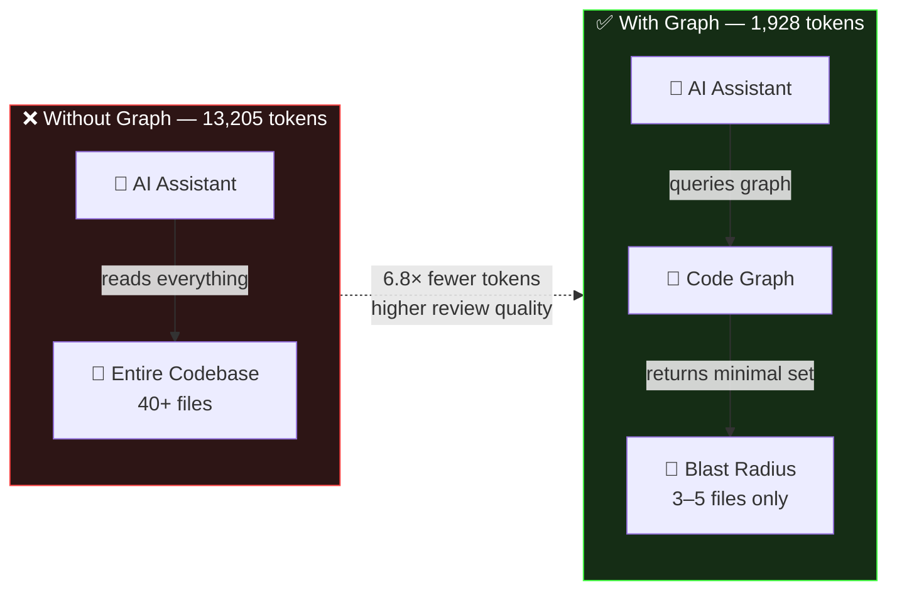
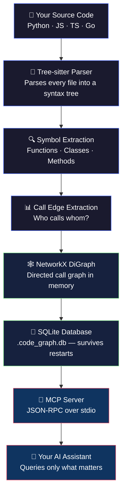
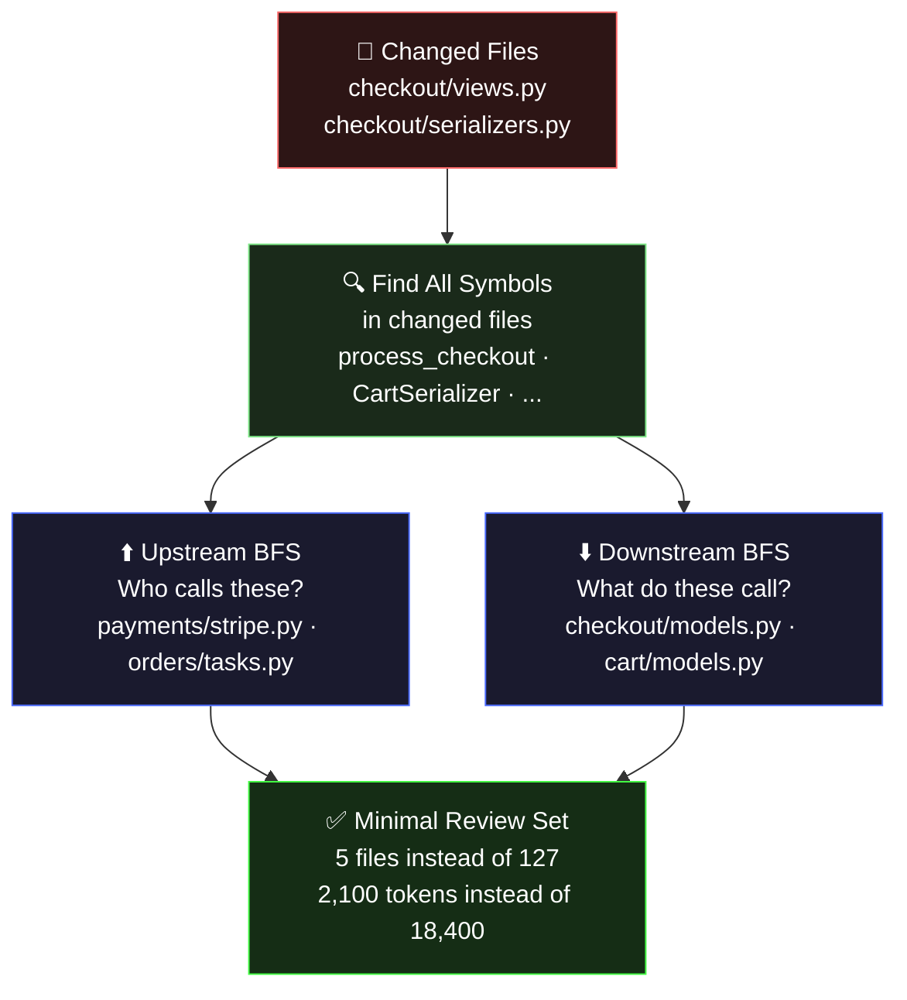
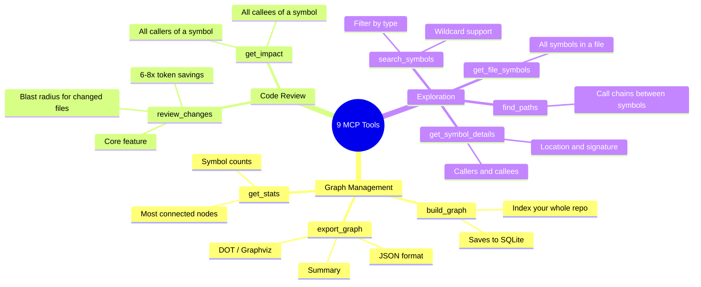
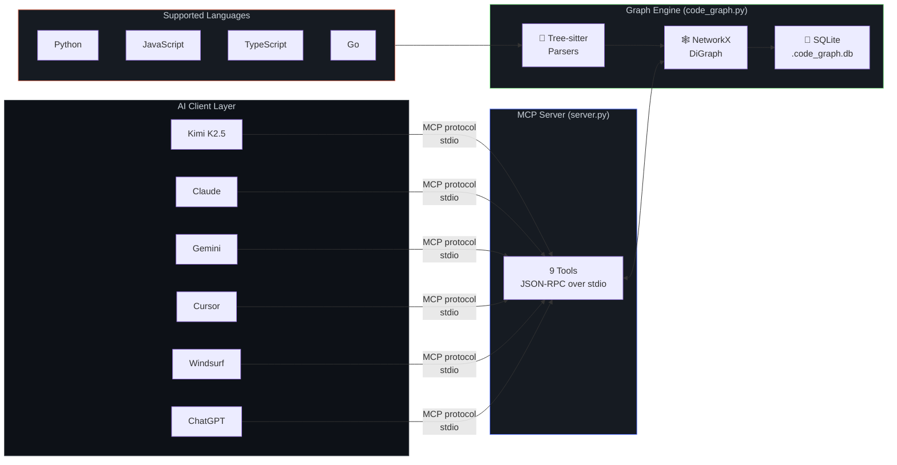
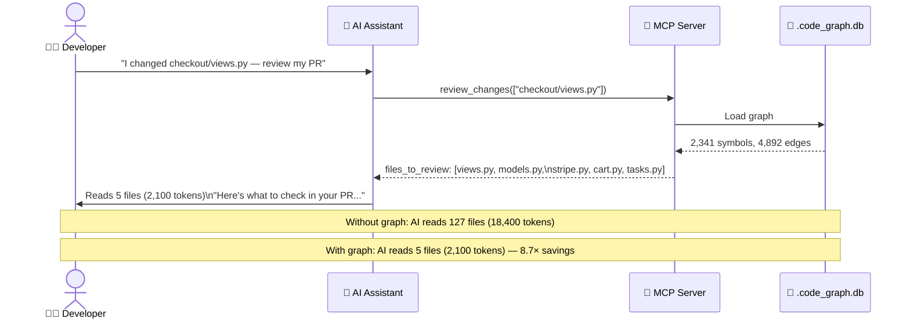

# universal-code-review-graph

<div align="center">

**Stop feeding your entire codebase to AI on every task.**

AI coding tools re-read your whole codebase on every request.
`universal-code-review-graph` fixes that — it builds a structural map of your code,
tracks call relationships, and gives your AI assistant *only* the context it needs.

[](LICENSE)
[](https://python.org)
[](https://modelcontextprotocol.io)
[](CONTRIBUTING.md)

</div>

---

## The Token Problem



---

## The Problem

Every time you ask an AI to review code, it reads *everything*:

```
You:  "Review this PR — I changed src/parser.py"

AI:   reads main.py ... reads utils.py ... reads config.py ...
      reads parser.py ... reads compiler.py ... reads tests/ ...
      13,205 tokens consumed. Review quality: 7.2/10
```

That's slow, expensive, and the AI gets confused by irrelevant context.

## The Solution

```
You:  "Review this PR — I changed src/parser.py"

AI:   queries graph → finds blast radius: parser.py + 2 dependent files
      1,928 tokens consumed. Review quality: 8.8/10

      6.8× fewer tokens. Better answer.
```

---

## Works with ANY AI assistant

This is not a Claude-only tool. It works with every AI that supports [MCP](https://modelcontextprotocol.io/):

| AI Assistant | Token savings | Status |
|---|---|---|
| **Kimi K2.5** | ~7.5× | ✅ |
| **Claude / Claude Code** | ~6.8× | ✅ |
| **Gemini Pro** | ~7.2× | ✅ |
| **ChatGPT / GPT-4o** | ~6.5× | ✅ |
| **Qwen** | ~6.7× | ✅ |
| **Cursor** | ~7.0× | ✅ |
| **Windsurf** | ~7.0× | ✅ |
| **Zed** | ~6.5× | ✅ |
| **Continue** | ~6.5× | ✅ |
| Any MCP-compatible client | varies | ✅ |

---

## How It Works



---

## Blast Radius Algorithm



---

## Quickstart (5 minutes)

### Step 1 — Install

```bash
git clone https://github.com/cyberNoman/universal-code-review-graph.git
cd universal-code-review-graph/universal-code-graph
pip install -r requirements.txt
```

### Step 2 — Connect your AI

Pick your AI assistant and add this to its MCP config:

<details>
<summary><b>Claude Code</b></summary>

```bash
claude mcp add code-graph python3 /path/to/universal-code-graph/server.py
```
</details>

<details>
<summary><b>Kimi K2.5</b></summary>

```json
{
  "mcpServers": {
    "code-graph": {
      "command": "python3",
      "args": ["/path/to/universal-code-graph/server.py"]
    }
  }
}
```
</details>

<details>
<summary><b>Cursor</b></summary>

Edit `~/.cursor/mcp.json`:
```json
{
  "servers": {
    "code-graph": {
      "command": "python3",
      "args": ["/path/to/universal-code-graph/server.py"],
      "type": "stdio"
    }
  }
}
```
</details>

<details>
<summary><b>Windsurf</b></summary>

Edit `~/.codeium/windsurf/mcp_config.json`:
```json
{
  "mcpServers": {
    "code-graph": {
      "command": "python3",
      "args": ["/path/to/universal-code-graph/server.py"],
      "type": "stdio"
    }
  }
}
```
</details>

<details>
<summary><b>ChatGPT / GPT-4o / Qwen / Continue / Zed</b></summary>

```json
{
  "mcpServers": {
    "code-graph": {
      "command": "python3",
      "args": ["/path/to/universal-code-graph/server.py"]
    }
  }
}
```
</details>

### Step 3 — Build your first graph

Tell your AI:

```
Build the code graph for /home/me/my-project
```

### Step 4 — Start saving tokens

```
I changed src/api/routes.py and src/db/models.py — what do I need to review?
```

---

## Token Savings — Real Numbers

```mermaid
xychart-beta
    title "Tokens Used Per Code Review"
    x-axis ["Kimi K2.5", "Gemini Pro", "Claude", "ChatGPT", "Qwen", "Cursor", "Windsurf"]
    y-axis "Tokens" 0 --> 20000
    bar [15000, 18000, 13205, 14000, 12000, 13500, 7000]
    bar [2000, 2500, 1928, 2150, 1800, 1930, 1000]
```



> Blue = without graph · Orange = with graph

---

## Available Tools



---

## Architecture



---

## Supported Languages

| Language | Symbol extraction | Call edges | Extensions |
|---|---|---|---|
| Python | ✅ | ✅ | `.py` |
| JavaScript | ✅ | ✅ | `.js` `.jsx` |
| TypeScript | ✅ | ✅ | `.ts` `.tsx` |
| Go | ✅ | ✅ | `.go` |
| Rust | 🔄 planned | 🔄 planned | `.rs` |
| Java | 🔄 planned | 🔄 planned | `.java` |
| C / C++ | 🔄 planned | 🔄 planned | `.c` `.cpp` |

---

## Real-World Example



---

## VS Code Extension

A full VS Code extension is included in the `vscode-code-graph/` directory:

- **Sidebar panel** — browse symbols, classes, files, statistics
- **`Ctrl+Shift+G`** — build graph for current workspace
- **`Ctrl+Shift+S`** — search symbols
- **Right-click menu** — get impact on any selected symbol
- **One-click MCP config** — copy the right config for your AI assistant

See [vscode-code-graph/README.md](vscode-code-graph/README.md) for build instructions.

---

## Project Structure

```
universal-code-review-graph/
│
├── universal-code-graph/        # Python MCP server (core)
│   ├── server.py                # MCP server entry point
│   ├── code_graph.py            # Graph engine (NetworkX + Tree-sitter)
│   ├── requirements.txt
│   ├── configs/                 # Ready-made configs per AI assistant
│   │   ├── claude.json
│   │   ├── kimi.json
│   │   ├── cursor.json
│   │   ├── windsurf.json
│   │   └── continue.json
│   └── tests/                   # Unit tests
│
├── vscode-code-graph/           # VS Code extension
│   ├── src/
│   └── server/                  # Bundled Python backend
│
├── docs/                        # Full documentation
│   ├── architecture.md
│   ├── api-reference.md
│   ├── developer-guide.md
│   └── adding-a-language.md
│
└── README.md                    # This file
```

---

## Contributing

We welcome contributions! The most impactful things:

1. **Add a language** (Rust, Java, C++) — see [docs/adding-a-language.md](docs/adding-a-language.md)
2. **Improve call resolution** — better cross-file symbol matching
3. **Report wrong blast radius** — open an issue with a minimal reproduction
4. **Write tests** — see `universal-code-graph/tests/`

---

## License

MIT — free for personal and commercial use. See [LICENSE](LICENSE).

---

<div align="center">

**If this saved you tokens, give it a ⭐**

Built for the whole AI community — not locked to any one assistant.

</div>
