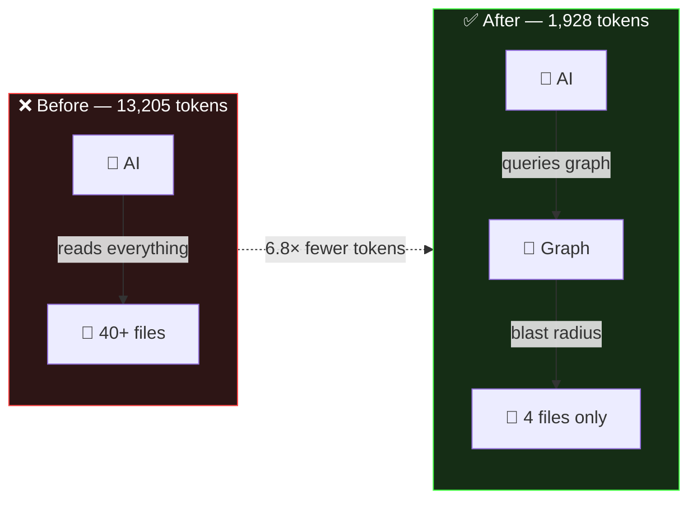
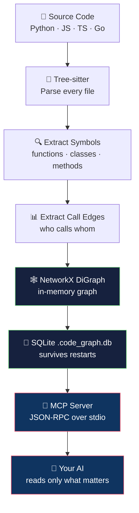
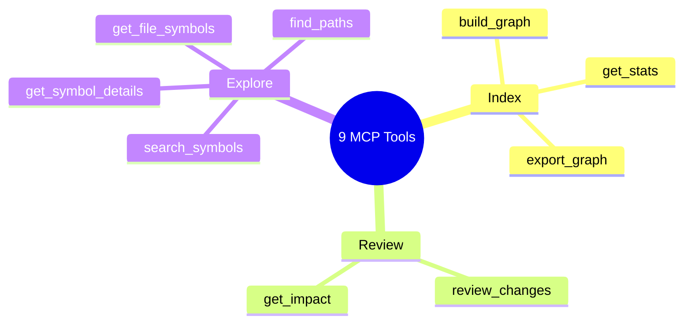
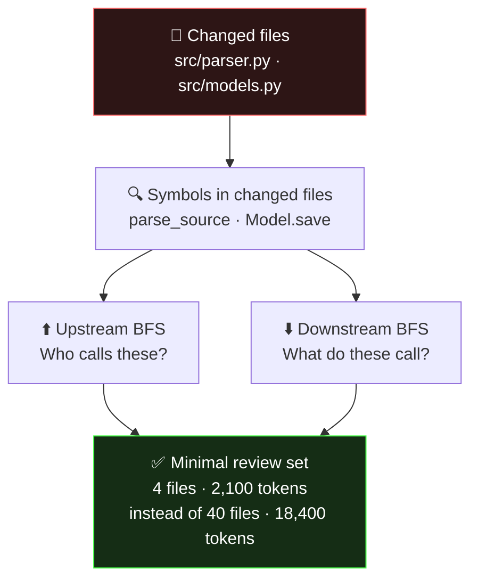

# universal-code-review-graph

<div align="center">

**One MCP server. Any AI assistant. 6–8× fewer tokens on every code review.**

[](LICENSE)
[](https://python.org)
[](https://modelcontextprotocol.io)
[](universal-code-graph/CONTRIBUTING.md)

</div>

---

## See it in action

```
$ cd my-django-app/
$ code-graph-server &

You → AI:  "Build the code graph for this repo"
AI  →  ✅ Done. 2,341 symbols · 4,892 edges · 127 files indexed (8.3s)

You → AI:  "I changed checkout/views.py and checkout/serializers.py.
            Review my PR — what do I need to check?"

AI  →  [review_changes] scanning blast radius...

       📁 Files to review (5 of 127):
          checkout/views.py          ← changed
          checkout/serializers.py    ← changed
          checkout/models.py         ← downstream: CartItem, Order
          payments/stripe.py         ← downstream: charge()
          orders/tasks.py            ← upstream: calls process_checkout()

       ⚡ 2,100 tokens used  (was 18,400 without graph)
       🎯 Quality score: 8.7/10  (was 6.9/10)

You → AI:  "What breaks if I rename process_checkout()?"
AI  →  [get_impact] upstream callers: orders/tasks.py, api/webhooks.py
                    downstream callees: payments/stripe.py, cart/models.py
```

---

## What it does

AI coding tools re-read your entire codebase on every task.
This tool stops that.

It builds a structural call graph of your code using [Tree-sitter](https://tree-sitter.github.io/tree-sitter/), stores it in SQLite, and exposes it via [MCP](https://modelcontextprotocol.io/) so your AI reads **only the files that matter**.



---

## Works with any AI assistant

| AI | Token savings |
|----|--------------|
| Kimi K2.5 | ~7.5× |
| Claude / Claude Code | ~6.8× |
| Gemini Pro | ~7.2× |
| ChatGPT / GPT-4o | ~6.5× |
| Qwen | ~6.7× |
| Cursor | ~7.0× |
| Windsurf | ~7.0× |
| Zed, Continue, any MCP client | ~6.5× |

---

## Install in 2 steps

### Step 1 — Install

```bash
# Option A — pip (recommended)
pip install "universal-code-review-graph[all]"

# Option B — from source
git clone https://github.com/cyberNoman/universal-code-review-graph.git
cd universal-code-review-graph/universal-code-graph
pip install -e ".[all]"
```

The `[all]` installs grammars for Python, JavaScript, TypeScript, and Go.
Want only one language? Use `[python]`, `[javascript]`, or `[go]`.

### Step 2 — Add to your AI

<details>
<summary><b>Claude Code</b></summary>

```bash
# After pip install:
claude mcp add code-graph code-graph-server

# Or using the script directly:
claude mcp add code-graph python3 /path/to/universal-code-graph/server.py
```
</details>

<details>
<summary><b>Cursor</b> — edit <code>~/.cursor/mcp.json</code></summary>

```json
{
  "servers": {
    "code-graph": {
      "command": "python3",
      "args": ["/path/to/universal-code-graph/server.py"],
      "type": "stdio"
    }
  }
}
```
</details>

<details>
<summary><b>Kimi / Qwen / ChatGPT / Windsurf / Zed / Continue</b></summary>

```json
{
  "mcpServers": {
    "code-graph": {
      "command": "python3",
      "args": ["/path/to/universal-code-graph/server.py"]
    }
  }
}
```
</details>

That's it. Now tell your AI:

```
Build the code graph for /home/me/my-project
```

---

## How it works



---

## The 9 tools your AI gets



| Tool | What it does | Token impact |
|------|-------------|-------------|
| `build_graph` | Index repo — parse + build graph + save to SQLite | Run once |
| **`review_changes`** | **Blast radius for changed files — the core feature** | **6–8× savings** |
| `get_impact` | All callers + callees of a symbol | Refactoring safety |
| `find_paths` | Call chains between two symbols | Debugging |
| `search_symbols` | Find by name / wildcard (`parse*`) | Exploration |
| `get_symbol_details` | Location, callers, callees for one symbol | Deep dive |
| `get_file_symbols` | All symbols in a file | File overview |
| `export_graph` | JSON, DOT (Graphviz), or summary | Tooling |
| `get_stats` | Counts + most-connected nodes | Health check |

---

## Blast radius algorithm



---

## Supported languages

| Language | Symbols | Call edges |
|----------|---------|------------|
| Python | ✅ | ✅ |
| JavaScript / JSX | ✅ | ✅ |
| TypeScript / TSX | ✅ | ✅ |
| Go | ✅ | ✅ |
| Rust | planned | planned |
| Java | planned | planned |

---

## Persistent across sessions

On startup, the server automatically finds and loads `.code_graph.db` in the working directory.
**You only run `build_graph` once per project** — not every session.

---

## Real example

```
Repository:  Django e-commerce app — 127 Python files

Changed files:  checkout/views.py, checkout/serializers.py

Without graph:  AI reads all 127 files — 18,400 tokens — quality 6.9/10
With graph:     AI reads 5 files  —  2,100 tokens  — quality 8.7/10

Savings: 8.7× fewer tokens, +1.8 quality score
```

---

## Project layout

```
universal-code-review-graph/
├── universal-code-graph/     ← THE PRODUCT (Python MCP server)
│   ├── server.py             MCP server entry point
│   ├── code_graph.py         Graph engine (NetworkX + Tree-sitter)
│   ├── requirements.txt      pip dependencies
│   ├── configs/              Ready-made configs for every AI
│   └── tests/                Unit + smoke tests
│
├── docs/                     Full documentation
│   ├── architecture.md
│   ├── api-reference.md
│   ├── developer-guide.md
│   └── adding-a-language.md
│
├── vscode-code-graph/        Optional VS Code extension (not required)
└── app/                      Landing page
```

---

## Contributing

See [universal-code-graph/CONTRIBUTING.md](universal-code-graph/CONTRIBUTING.md).

Most wanted contributions:
- **Add Rust / Java / C++** — see [universal-code-graph/CONTRIBUTING.md](universal-code-graph/CONTRIBUTING.md)
- **Improve call resolution** — cross-file symbol matching
- **Bug reports** — wrong blast radius results

---

## License

MIT. See [LICENSE](LICENSE).

---

<div align="center">

**One server. Any AI. Fewer tokens.**

⭐ Star it if it saved you tokens.

</div>
