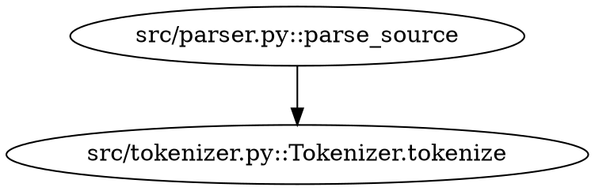

# API Reference

Complete reference for all 9 MCP tools exposed by the server.

---

## `build_graph`

Build or rebuild the code graph for a repository.
Parses all source files, extracts symbols and call relationships,
and persists everything to `.code_graph.db`.

**When to call:** Once per project. Re-call after large refactors or adding new files.
The server auto-loads the DB on startup, so you don't need to re-call between sessions.

### Parameters

| Name | Type | Required | Default | Description |
|------|------|----------|---------|-------------|
| `repo_path` | string | ✅ | — | Absolute path to the repo root |
| `language` | string | ❌ | `"auto"` | Hint: `python`, `javascript`, `typescript`, `go`, `auto` |
| `exclude_patterns` | string[] | ❌ | See below | Glob patterns to skip |

**Default exclude patterns:**
```
**/test_*.py   **/tests/**   **/node_modules/**   **/.git/**
**/__pycache__/**   **/*.min.js   **/dist/**   **/build/**
**/venv/**   **/.venv/**
```

### Response

```json
{
  "status": "success",
  "message": "Graph built and persisted to .code_graph.db",
  "stats": {
    "files_processed": 43,
    "symbols_found": 847,
    "edges_found": 1203,
    "repo_path": "/home/me/myproject"
  }
}
```

### Example

```
Build the code graph for /home/me/my-django-app, excluding tests
```

---

## `review_changes`

**The core token-saving tool.**

Given a list of changed files, returns the minimal set of symbols and files
the reviewer needs to examine — the "blast radius" of the change.

### Parameters

| Name | Type | Required | Default | Description |
|------|------|----------|---------|-------------|
| `changed_files` | string[] | ✅ | — | Relative paths from repo root |
| `include_upstream` | boolean | ❌ | `true` | Include functions that call the changed code |
| `include_downstream` | boolean | ❌ | `true` | Include functions called by the changed code |
| `max_depth` | integer | ❌ | `3` | How many hops to traverse |

### Response

```json
{
  "changed_files": ["src/parser.py", "src/tokenizer.py"],
  "impacted_symbols": [
    "src/parser.py::parse_source",
    "src/tokenizer.py::Tokenizer.tokenize",
    "src/compiler.py::compile_ast",
    "src/pipeline.py::run_pipeline"
  ],
  "total_impacted": 7,
  "upstream_count": 4,
  "downstream_count": 3,
  "files_to_review": [
    "src/parser.py",
    "src/tokenizer.py",
    "src/compiler.py",
    "src/pipeline.py"
  ]
}
```

### Example

```
I changed checkout/views.py and checkout/serializers.py. What do I need to review?
```

---

## `get_impact`

Find all upstream callers and downstream callees of a specific symbol.
Useful when refactoring a function and you need to know everything that will be affected.

### Parameters

| Name | Type | Required | Default | Description |
|------|------|----------|---------|-------------|
| `symbol` | string | ✅ | — | Symbol name (short or fully-qualified) |
| `max_depth` | integer | ❌ | `5` | Maximum traversal depth |

### Response

```json
{
  "symbol": "parse_source",
  "upstream": ["compile_ast", "run_pipeline", "main"],
  "downstream": ["tokenize", "build_ast", "read_file"],
  "upstream_count": 3,
  "downstream_count": 3
}
```

### Example

```
What functions depend on parse_source? And what does it call?
```

---

## `find_paths`

Find all call paths between two symbols.
Useful for tracing how a high-level function eventually calls a low-level one.

### Parameters

| Name | Type | Required | Default | Description |
|------|------|----------|---------|-------------|
| `source` | string | ✅ | — | Starting symbol name |
| `target` | string | ✅ | — | Ending symbol name |
| `max_paths` | integer | ❌ | `5` | Maximum paths to return |

### Response

```json
{
  "source": "main",
  "target": "read_file",
  "paths_found": 2,
  "paths": [
    ["main", "run_pipeline", "parse_source", "read_file"],
    ["main", "compile_ast", "parse_source", "read_file"]
  ]
}
```

### Example

```
How does main() eventually call read_file()?
```

---

## `search_symbols`

Search for symbols by name or wildcard pattern.

### Parameters

| Name | Type | Required | Default | Description |
|------|------|----------|---------|-------------|
| `query` | string | ✅ | — | Name or wildcard (`parse*`, `*handler`, `User*`) |
| `symbol_type` | string | ❌ | `"any"` | Filter: `function`, `class`, `method`, `import`, `any` |
| `limit` | integer | ❌ | `20` | Maximum results |

### Response

```json
{
  "query": "parse*",
  "matches_found": 4,
  "symbols": [
    {
      "name": "src/parser.py::parse_source",
      "short_name": "parse_source",
      "symbol_type": "function",
      "file_path": "src/parser.py",
      "line_start": 42,
      "line_end": 78
    }
  ]
}
```

### Example

```
Find all functions with "parse" in the name
```

---

## `get_symbol_details`

Get full details about one symbol: location, docstring, who calls it, what it calls.

### Parameters

| Name | Type | Required | Description |
|------|------|----------|-------------|
| `symbol` | string | ✅ | Symbol name (short or fully-qualified) |

### Response

```json
{
  "symbol": {
    "name": "src/parser.py::parse_source",
    "short_name": "parse_source",
    "symbol_type": "function",
    "file_path": "src/parser.py",
    "line_start": 42,
    "line_end": 78,
    "parent": null
  },
  "called_by": ["src/compiler.py::compile_ast", "src/pipeline.py::run_pipeline"],
  "calls": ["src/tokenizer.py::Tokenizer.tokenize", "src/ast.py::build_ast"],
  "called_by_count": 2,
  "calls_count": 2
}
```

---

## `get_file_symbols`

List all symbols defined in a specific file.

### Parameters

| Name | Type | Required | Description |
|------|------|----------|-------------|
| `file_path` | string | ✅ | File path relative to repo root |

### Response

```json
{
  "file": "src/parser.py",
  "symbols_defined": [
    { "name": "src/parser.py::Parser", "symbol_type": "class", "line_start": 10 },
    { "name": "src/parser.py::Parser.parse", "symbol_type": "method", "line_start": 20 },
    { "name": "src/parser.py::parse_source", "symbol_type": "function", "line_start": 42 }
  ]
}
```

---

## `export_graph`

Export the graph in a machine-readable format.

### Parameters

| Name | Type | Required | Default | Description |
|------|------|----------|---------|-------------|
| `format` | string | ❌ | `"summary"` | `json`, `dot`, `summary` |

### Formats

**`summary`** — counts and top nodes (most useful for quick checks):
```json
{
  "total_symbols": 847,
  "total_edges": 1203,
  "files_indexed": 43,
  "symbol_types": { "function": 412, "class": 89, "method": 346 }
}
```

**`json`** — full node + edge list (use for custom tooling):
```json
{
  "nodes": [ { "name": "...", "symbol_type": "..." } ],
  "edges": [ { "source": "...", "target": "...", "call_type": "..." } ]
}
```

**`dot`** — Graphviz DOT format (use for visualization):


---

## `get_stats`

Get statistics and the most-connected symbols in the graph.

### Response

```json
{
  "total_symbols": 847,
  "total_edges": 1203,
  "files_indexed": 43,
  "symbol_types": {
    "function": 412,
    "class": 89,
    "method": 346
  },
  "most_connected": [
    {
      "name": "src/utils.py::helpers",
      "short_name": "helpers",
      "type": "function",
      "total_connections": 47,
      "incoming": 44,
      "outgoing": 3
    }
  ]
}
```

The `most_connected` list is the most useful part — highly-connected nodes are the
riskiest to change, as they affect many other symbols.

---

## Error responses

All tools return a consistent error format when something goes wrong:

```json
{ "error": "No graph loaded. Call build_graph first." }
{ "error": "Symbol 'parse_xyz' not found" }
{ "error": "Repository path does not exist: /bad/path" }
```

---

## Symbol name formats

Symbols can be referenced by short name or fully-qualified name:

| Format | Example | Use when |
|--------|---------|----------|
| Short name | `parse_source` | Name is unique across the codebase |
| Qualified | `MyClass.parse_source` | Method on a specific class |
| Full key | `src/parser.py::MyClass.parse_source` | Name exists in multiple files |

The server resolves short names automatically. If a short name matches multiple
symbols, the first match is used — use the full key for precision.
